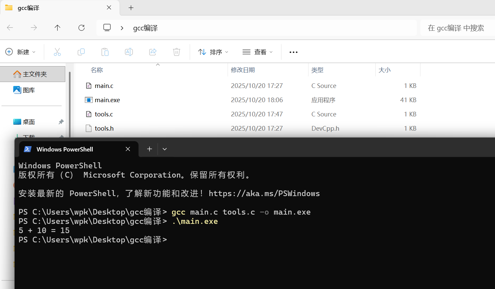

#静态库、动态库和环境变量
小白hh
##静态库
静态库在编译阶段，其代码会被嵌入到可执行程序中。这使得程序运行不依赖外部库，但会导致程序体积增大，就像将所有零件直接组装进大机器，虽能独立运行，却变得庞大。
##动态库
动态库在程序运行时才被加载调用，多个程序可共享，能有效节省空间。例如，若系统中有多个程序需同一功能，它们可在运行时调用同一个动态库，无需各自保存功能代码。
##环境变量
环境变量如同电脑的导航地图。设置后，系统能快速定位库文件与可执行程序位置，无论查找动态库还是静态库都更便捷，程序运行更顺畅。比如设置环境变量指向某库存放位置，程序调用时系统可快速找到，无需手动指定。

 
 
